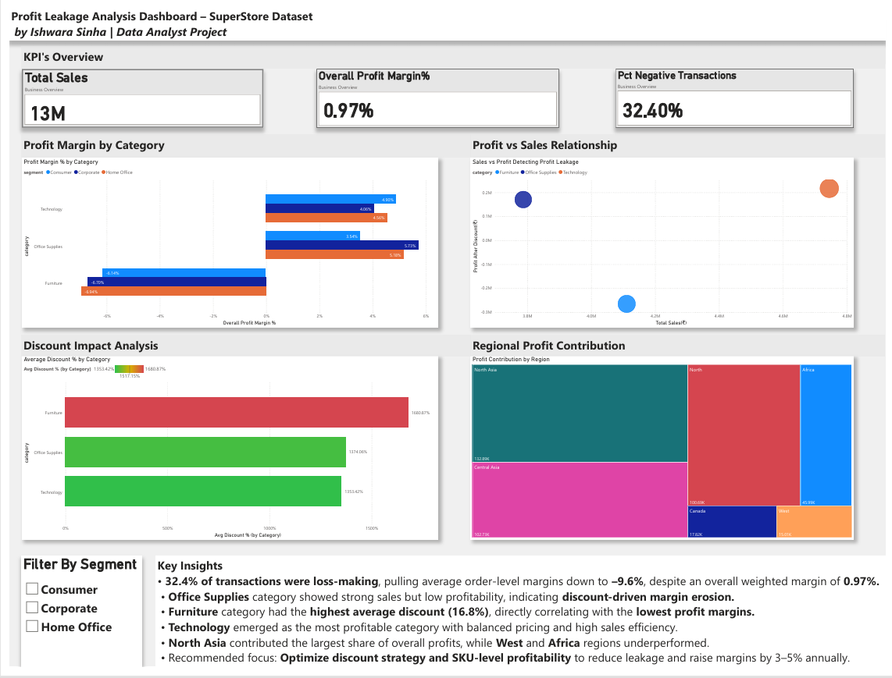

# 💹 Profit Leakage Analysis Dashboard – SuperStore Dataset  
**By Ishwara Sinha | Data Analyst Project**

### 🧭 Overview
This Power BI dashboard identifies areas of profit leakage in the SuperStore dataset by analyzing sales, profit margins, discounts, and regional contributions.  
It helps uncover how excessive discounting affects profitability and provides actionable insights for revenue optimization.

### 🛠 Tools & Skills Used
- Microsoft Excel (Data Cleaning)
- Power BI (Visualization, DAX Measures, Interactive Dashboard)
- Data Analysis Expressions (DAX)
- Business Problem Solving & Storytelling

### 📊 Key Insights
- **32.4% of transactions are loss-making**, pulling the average order margin to **–9.6%**, while overall weighted margin remains **0.97%**.
- **Office Supplies** show high sales but low profits → discount-driven margin erosion.  
- **Furniture** has the **highest average discount (16.8%)**, leading to the **lowest profit margin**.  
- **Technology** is the most profitable category with healthy margins.  
- **North Asia** contributes the largest share of profit; **West & Africa** regions underperform.

### 🧠 Business Impact
Identifying and optimizing high-discount SKUs can improve profit margins by 3–5% annually through better discount control and pricing strategy.

### 📂 Files in this Repository
| File | Description |
|------|--------------|
| `Profit_Leakage_Analysis_Ishwara.pbix` | Main Power BI dashboard file |
| `superstore cleaned data by ishwara.xlsx` | (Cleaned dataset used for analysis |
| `README.md` | Project documentation |

### 🚀 How to Use
1. Download the `.pbix` file.
2. Open in **Power BI Desktop** (free).
3. Explore interactive filters by category, region, and segment.

### 🧾 Snapshot

---

⭐ *If you found this interesting, feel free to star the repo or connect on [LinkedIn](https://linkedin.com/in/ishwara-sinha)*  
